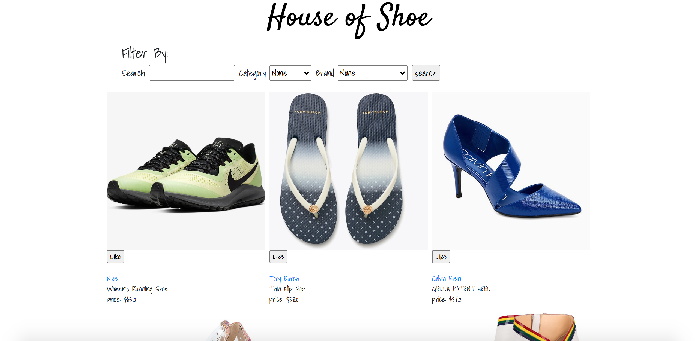

# House of Shoes
 

## Technologies Implemented

- Ruby on Rails
- Bootstrap

## Aplication Figure

Project Page: 
 

 

 

 

 

## How it works?

- First, click 'shoe crushes' to go through all the shoes 
- Second, sign up
- Search or filter by categories and brands
- Use the like button to add your favorite shoes in your dashboard / crush list

